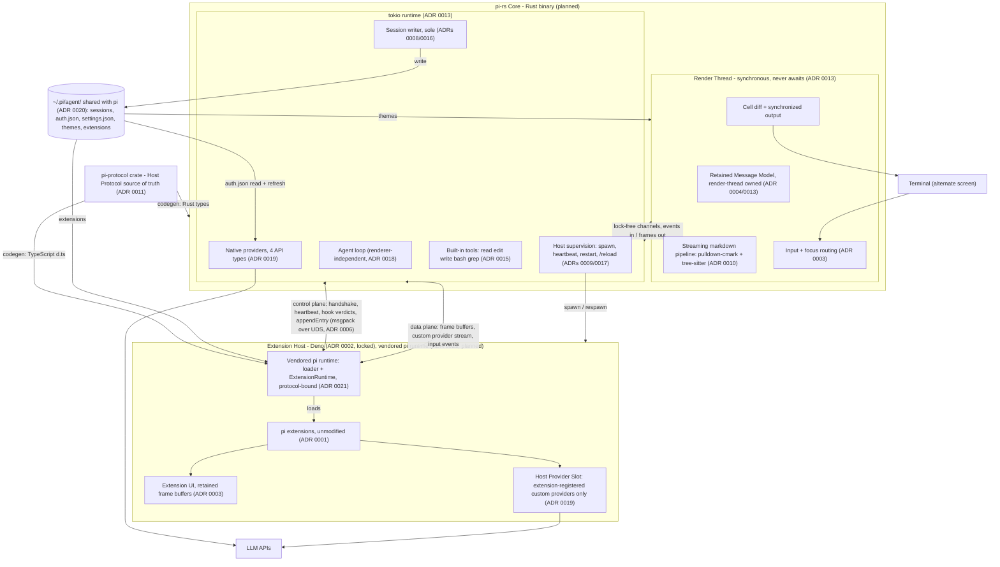

# pi-rs

A Rust rewrite of the [pi coding agent](https://github.com/earendil-works/pi): native core for the terminal UI and agent loop, full compatibility with existing TypeScript pi extensions via a separate Extension Host process.

**Status: planning.**

- [docs/PHILOSOPHY.md](./docs/PHILOSOPHY.md): the working philosophy and code rules, sourced
- [docs/GOALS.md](./docs/GOALS.md): the three project goals, in priority order
- [CONTEXT.md](./CONTEXT.md): the domain language
- [docs/adr/](./docs/adr/): architectural decisions
- [docs/pitfalls.md](./docs/pitfalls.md): field-verified rendering failures pi-rs must design and test against
- [docs/research.md](./docs/research.md): implementation research notes de-risking the ADRs
- [docs/ROADMAP.md](./docs/ROADMAP.md): dependency-ordered phases with exit gates

## Why

Today's agent TUIs leave rendering quality on the table, each for a different reason. Claude Code (Ink/React) redraws the full viewport on state changes - the documented [flicker in multiplexers](https://github.com/anthropics/claude-code/issues/37076), [typing lag](https://github.com/anthropics/claude-code/issues/31194), and [exit corruption](https://github.com/anthropics/claude-code/issues/42087) are architectural, not incidental. Codex CLI is Rust/ratatui and still ships [unstable scrollback and platform-dependent rendering](https://github.com/openai/codex/discussions/1174) - native code is necessary but not sufficient. pi does better with [differential line-based rendering](https://github.com/earendil-works/pi/blob/main/packages/coding-agent/docs/tui.md), but remains bounded by its JavaScript runtime and line-granular diffing. [agent-session-recorder](https://github.com/thiscantbeserious/agent-session-recorder) demonstrated what the alternative feels like: a Rust render loop with cell-level diffing, synchronized output, and partial line updates draws in microseconds. pi-rs applies that render architecture to a full coding agent, without giving up pi's extension ecosystem.

- Native render core: cell-diff frames, synchronized output, latency isolated from extension code
- Existing pi extensions run unmodified in an Extension Host (VS Code-style architecture)
- Runtime-agnostic Host Protocol: Deno-first (permissions sandbox), Node fallback

## Target architecture

The single visual source of truth, reflecting the accepted ADRs in [docs/adr/](./docs/adr/). Status legend: everything is `planned` until the ROADMAP phase that builds it exits its gate. Update this diagram before merging work that changes the architecture.

## Decisions so far

- [ADR 0001](./docs/adr/0001-extension-host-process.md): Extensions run in a separate Extension Host process
- [ADR 0002](./docs/adr/0002-host-protocol-deno-first.md): Runtime-agnostic Host Protocol, Deno host first, Node as fallback
- [ADR 0003](./docs/adr/0003-retained-frame-buffers-for-extension-ui.md): Extension UI crosses the Host Protocol as retained frame buffers
- [ADR 0004](./docs/adr/0004-alternate-screen-retained-message-model.md): Alternate screen with a retained message model
- [ADR 0005](./docs/adr/0005-provider-trait-host-proxy-bootstrap.md): Provider trait with host-proxy bootstrap (bootstrap superseded by ADR 0019)
- [ADR 0006](./docs/adr/0006-host-protocol-msgpack-uds.md): Host Protocol: length-prefixed MessagePack over Unix domain sockets
- [ADR 0007](./docs/adr/0007-oracle-guided-full-parity.md): V1 bar is full parity, oracle-guided and measured by session replay
- [ADR 0008](./docs/adr/0008-native-pi-session-format.md): Sessions use pi's native format, bidirectionally
- [ADR 0009](./docs/adr/0009-hook-heartbeat-fail-closed.md): Tool-call hooks: unbounded await, heartbeat liveness, fail-closed
- [ADR 0010](./docs/adr/0010-streaming-markdown-pipeline.md): Streaming markdown pipeline: pulldown-cmark structure, tree-sitter highlighting
- [ADR 0011](./docs/adr/0011-workspace-generated-protocol.md): Cargo workspace with a single-source-of-truth, codegen'd Host Protocol
- [ADR 0012](./docs/adr/0012-native-pi-themes-capture-mapping.md): Themes use pi's native JSON format with a tree-sitter capture mapping
- [ADR 0013](./docs/adr/0013-render-thread-plus-tokio.md): Dedicated synchronous render thread. Tokio for everything async
- [ADR 0014](./docs/adr/0014-platform-scope-wsl-yes-windows-later.md): V1 platforms: Linux, macOS, WSL. Native Windows post-parity
- [ADR 0015](./docs/adr/0015-builtin-tools-rust-native.md): Built-in tools are Rust-native in the Core
- [ADR 0016](./docs/adr/0016-core-sole-session-writer.md): The Core is the sole session writer
- [ADR 0017](./docs/adr/0017-reload-is-host-restart.md): /reload restarts the Extension Host process
- [ADR 0018](./docs/adr/0018-subagents-extension-core-aware.md): Subagents stay an extension. The Core is designed subagent-aware
- [ADR 0019](./docs/adr/0019-providers-rust-native-day-one.md): Providers are Rust-native from day one, the host is strictly extensions-only (supersedes the ADR 0005 bootstrap)
- [ADR 0020](./docs/adr/0020-pi-rs-binary-shared-pi-tree.md): pi-rs binary name, fully shared ~/.pi config tree
- [ADR 0021](./docs/adr/0021-vendor-pi-runtime-as-deno-host.md): Vendor pi's extension runtime as the Deno Host, with a Rust protocol backend
- [ADR 0022](./docs/adr/0022-phase-1-host-protocol-minimal-set-framing-lifecycle.md): Phase 1 Host Protocol minimal message set, framing, and lifecycle semantics
- [ADR 0023](./docs/adr/0023-phase-1-host-lifecycle-state-machine-supervision-restart.md): Phase 1 host lifecycle state machine, supervision, and restart policy

## Platform support (v1)

| Platform | Status |
| --- | --- |
| Linux | supported, CI-tested |
| macOS | supported, CI-tested |
| WSL | supported, smoke-tested |
| Windows (native) | post-parity, not yet supported |
